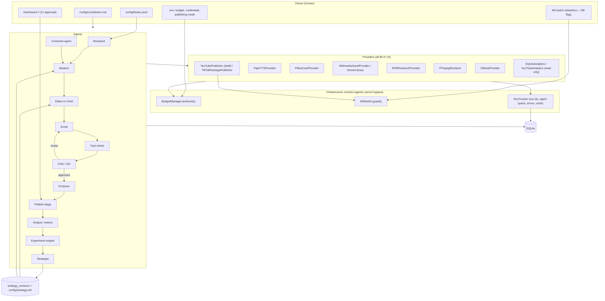

# Architecture

## Principle

The AI controls creative operations. The owner controls assets, money, credentials, legal
authority, publishing permissions, and the kill switch. Both are enforced in code, not in prompts.

## System diagram



## Cycle

`Orchestrator.cycle()` runs the stages in order; each is individually runnable from the CLI.

| # | Stage | Agent | Input | Output |
|---|---|---|---|---|
| 1 | research | `ResearchAgent` | `feeds.yaml` | `source_items` (deduplicated by URL hash and normalized title, freshness-scored) |
| 2 | ideas | `IdeationAgent` | fresh leads + strategy memory | scored `ideas` (12 sub-scores, opportunity score, $0-feasibility filter) |
| 3 | select | `EditorInChief` | candidates + allocation plan + running experiments | `selected` ideas with `allocation_mode`, experiment arm |
| 4 | write | `ScriptAgent` → `FactCheckAgent` → `CriticAgent` (≤ `max_revision_rounds`) | idea + stored sources | `scripts` (`approved` / `needs_owner_review` / `rejected`), `claims` |
| 5 | produce | `ProducerAgent` | approved script | narration WAVs, scene cards, licensed assets, `Timeline`, MP4, thumbnail, SRT |
| 6 | publish | `PublishStage` | rendered video | `publications` (packaged / uploaded / blocked / failed), owner packages |
| 7 | metrics | `AnalystAgent.collect_metrics` | enabled analytics providers | `metrics` snapshots |
| 8 | comments | `CommentAgent` | enabled analytics providers | classified `comments`, audience leads |
| 9 | learn | `AnalystAgent.learn` | metrics, experiments, source yield | new `strategy_versions` row, `config/strategy.md`, `data/reports/daily_*.md` |

## The feedback loop (the important part)

1. `SQLiteAnalyticsProvider.video_performance()` joins the latest metric snapshot per publication
   with the idea's family / hook / allocation mode / experiment arm and computes a composite
   0..1 `performance_score` (retention 35 %, shares/1k 25 %, subs/1k 20 %, completion 20 %; views
   alone are capped at 0.3).
2. `ExperimentEngine.evaluate_all()` compares arms with a Welch t approximation. Nothing concludes
   below `min_sample` per arm; a "no detectable effect" verdict needs 3x that.
3. `plan_allocation()` decides how many production slots explore vs exploit. Exploration decays
   from 70 % to a 25 % floor as measured videos accumulate, and exploit picks come from a
   Thompson-style posterior sample per family, so one viral video cannot lock the strategy. The
   constitution rule "test at least three families first" is enforced here.
4. `AnalystAgent.learn()` feeds the numbers to the model for a `StrategyUpdate`; the merge in
   `StrategyMemory.apply_update()` keeps computed statistics authoritative and refuses
   winner/loser/retired labels under three samples.
5. The next cycle's `IdeationAgent` and `EditorInChief` read the saved strategy: family status
   adjusts opportunity scores, retired families are excluded, and the explore ratio drives selection.

## Provider contract

```python
class Provider:
    name: str
    is_paid: bool = False
    def estimate_cost(self, purpose, **kw) -> float: ...
    def health(self) -> HealthStatus: ...
    @contextmanager
    def authorized(self, ctx, purpose, estimated_cost=None, **kw):
        # kill switch (paid providers), BudgetManager.authorize(), provider_usage row, ledger settle
```

Interfaces: `LLMProvider`, `TTSProvider`, `ImageProvider`, `VideoProvider`, `AssetProvider`,
`ResearchProvider`, `Publisher`, `AnalyticsProvider`. Concrete providers are wired in
`providers/registry.py`. Paid templates live in `providers/paid_examples.py` and are never
registered in V0; even if they were, `MONTHLY_BUDGET_USD=0.00` denies them before any I/O.

## Internal timeline schema

`Timeline(video_id, title, width, height, fps, scenes[], total_duration_s, disclosure_text, sources[], attributions[])`

`Scene(idx, start_s, duration_s, narration, caption, visual_type, asset_id, asset_path, crop, zoom, animation, transition, source, disclosure, notes, audio_path, image_path, caption_chunks[])`

The renderer turns each scene into a looped still with a Ken Burns zoom and its narration, joins
them with the concat demuxer, and burns caption chunks (timed from per-sentence TTS) from an ASS
file. Everything runs from a `work/` directory with relative paths to avoid Windows filter escaping.

## Reliability

- Every top-level invocation gets a `run_id`; every agent operation an `agent_runs` span with
  input/output refs, duration, error, estimated and actual cost.
- Idempotent operations (feed fetch, model calls) use bounded retries; uploads never do.
- Publications are a state machine keyed by `(video, platform, mode)`; a failed upload waits
  for an explicit owner retry.
- The kill switch is a sentinel file **and** a DB flag; either engages it.
- Structured JSON logs at `data/logs/aimz.jsonl`.

## Package layout

```
src/aimz/
  cli.py  settings.py  logging_setup.py  util.py  doctor.py
  core/        budget.py  killswitch.py  runs.py  retry.py  errors.py
  db/          connection.py  migrations.py  migrations/0001_initial.sql
  domain/      models.py            (pydantic schemas: LLM I/O + timeline)
  providers/   base.py  registry.py  paid_examples.py
               llm/ tts/ image/ video/ assets/ research/ publishers/ analytics/
  agents/      research ideation editor script factcheck critic producer publisher analyst comments
  experiments/ allocation.py  engine.py
  strategy/    memory.py
  pipeline/    orchestrator.py
  dashboard/   app.py  templates/  static/
```
