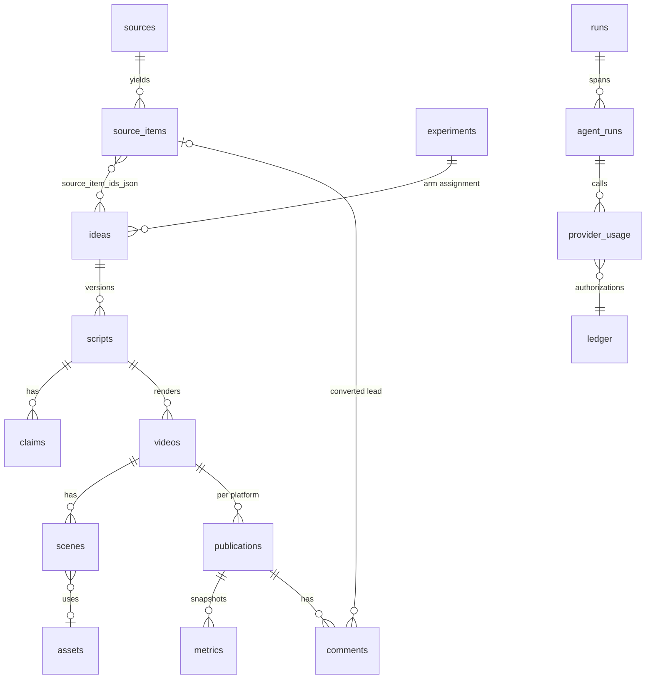

# Database schema

SQLite in V0 (`data/aimz.sqlite3`, WAL mode). Conventions chosen for a painless move to
Postgres/Supabase: TEXT ids (prefixed, time-sortable), ISO-8601 TEXT timestamps, JSON as TEXT,
`?` placeholders only, no rowid reliance, numbered `.sql` migrations recorded in
`schema_migrations`. See [FUNDED_V1.md](FUNDED_V1.md) for the migration recipe.

| Table | Purpose | Key columns |
|---|---|---|
| `system_state` | key/value flags (kill switch, last reviews) | `key`, `value` |
| `runs` | one row per CLI/cycle invocation | `kind`, `status`, `summary_json` |
| `agent_runs` | per-agent operation spans | `agent`, `operation`, `status`, `duration_ms`, `input_refs_json`, `output_refs_json`, `estimated_cost_usd`, `actual_cost_usd` |
| `provider_usage` | every provider call | `provider`, `action`, `content_id`, `tokens_in/out`, `estimated/actual_cost_usd`, `status` |
| `ledger` | money: authorizations, denials, spend, revenue, owner injections, reinvestment | `entry_type`, `amount_usd`, `budget_month` |
| `errors` | captured exceptions with traceback | `agent`, `operation`, `error_type` |
| `configuration_versions` | audit trail of owner config changes | `key`, `content`, `changed_by` |
| `sources` | research feeds (+ `audience`) with yield counters | `kind`, `credibility`, `items_yielded`, `ideas_yielded`, `videos_yielded`, `last_status` |
| `source_items` | leads | `url_hash` (unique), `dedupe_key`, `freshness_score`, `credibility`, `copyright_notes`, `status` |
| `ideas` | scored candidates | `hook_type`, `content_family`, `scores_json`, `opportunity_score`, `status`, `allocation_mode`, `experiment_id`, `experiment_arm` |
| `scripts` | versioned scripts with QA state | `version`, `beats_json`, `narration_text`, `status`, `qa_json`, `factcheck_json` |
| `claims` | factual claims with verification | `claim_type`, `source_urls_json`, `verification_status` |
| `assets` | licensed media with attribution | `provider`, `license`, `license_url`, `attribution`, `sha256` |
| `videos` | rendered outputs | `file_path`, `duration_s`, `timeline_json`, `production_seconds`, `production_cost_usd`, `ai_disclosure`, `status` |
| `scenes` | timeline rows | `idx`, `start_s`, `duration_s`, `visual_type`, `asset_id`, `zoom`, `transition`, `disclosure` |
| `publications` | per-platform publish state machine | `mode`, `idempotency_key` (unique), `platform_video_id`, `url`, `status`, `attempts`, `posted_at` |
| `metrics` | performance snapshots (API or manual) | `views`, `impressions`, `ctr`, `retention_3s`, `avg_watch_time_s`, `avg_percent_viewed`, `completion_rate`, `likes`, `comments`, `shares`, `subscribers_gained`, `followers_gained`, `returning_viewers`, `revenue_usd` |
| `comments` | classified audience comments | `classification`, `sentiment`, `useful`, `converted_source_item_id` |
| `experiments` | explicit hypotheses | `variable`, `control`, `treatment`, `primary_kpi`, `min_sample`, `status`, `result_json`, `confidence`, `conclusion` |
| `strategy_versions` | durable strategy memory | `version`, `created_by`, `state_json`, `markdown`, `change_summary` |

## Status vocabularies

- `source_items.status`: `new` → `used` | `ignored`
- `ideas.status`: `candidate` → `selected` → `scripted` → `produced` → `published`; or `rejected` / `killed`
- `scripts.status`: `draft` → `factchecked` → `qa_passed`/`qa_failed` → `approved` | `needs_owner_review` | `rejected`
- `videos.status`: `planned` → `rendering` → `rendered` → `approved` → `published`; or `failed` / `rejected`
- `publications.status`: `pending` → `packaged` | `uploading` → `uploaded` → `published`; or `blocked` / `failed`
- `experiments.status`: `proposed` → `running` → `concluded` | `retired`

## Adding a migration

Create `src/aimz/db/migrations/0002_<name>.sql`; it is applied on the next `connect()`.
Migrations run inside a transaction and are recorded with a timestamp. Keep them additive
(new tables/columns) so older code paths keep working during a rollout.
